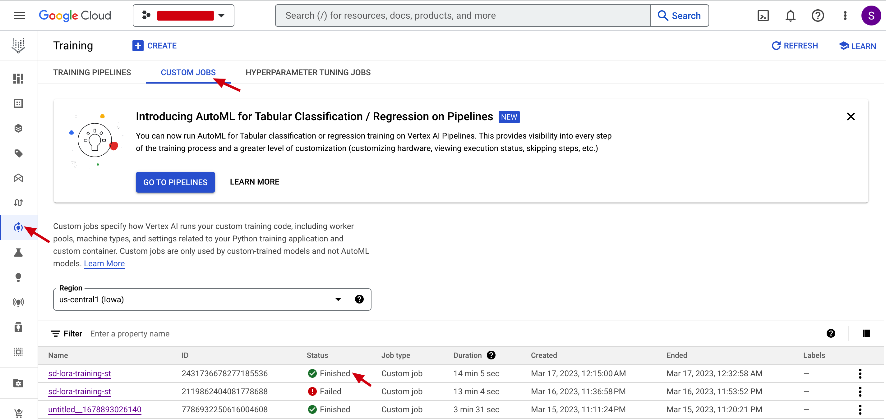
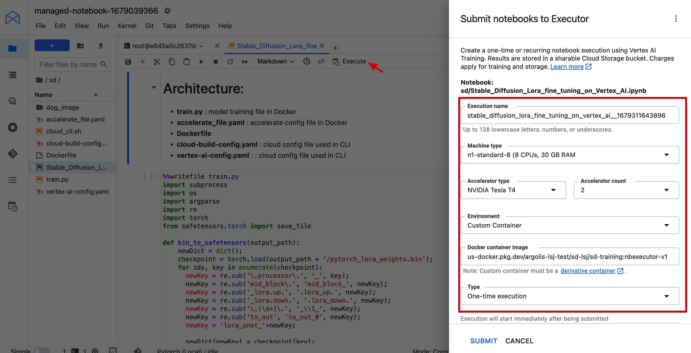
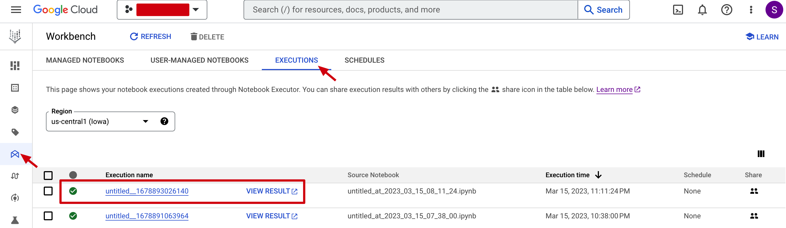

# **Stable Diffusion Fine-tuning on Google Cloud Quick Start Guide**

This guide gives simple steps for stable diffusion users to fine-tune stable diffusion using dreambooth with LoRA on Google Cloud Vertex AI. Two options are provided, one is Vertex AI custom training service, the other is Workbench executor. User can just follow the step have your stable diffusion model training.

* [Introduction](#Introduction)
* [Vertex AI custom training](#Vertex_AI_Custom_Training)
* [Vertex AI Workbench executor](#Vertex_AI_Workbench_Executor)

## Introduction
   [Vertex AI](https://cloud.google.com/vertex-ai/docs/start/introduction-unified-platform) is a machine learning (ML) platform that lets you train and deploy ML models and AI applications. Vertex AI combines data engineering, data science, and ML engineering workflows, enabling your teams to collaborate using a common toolset.

   [Diffusers](https://github.com/huggingface/diffusers) is the go-to library for state-of-the-art pretrained diffusion models for generating images, audio, and even 3D structures of molecules. It provides diffusion model's training, inference on GPU and TPU.

   In the project, we just use Diffusers library, demo **Dreambooth with LoRA** training on GPU on Vertex AI, while Dreambooth, text2image are also similar. 

   This project also uses Cloud Build to quickly build up a docker image for training.

   Customer can just use [Huggingface pre-trained Stable Diffusion model](https://huggingface.co/runwayml/stable-diffusion-v1-5) as base model or prepare the stable diffusion model by yourself.
   
## Vertex AI Custom Training

Vertex AI provides a [managed training service](https://cloud.google.com/vertex-ai/docs/training/overview) that enables you to operationalize large scale model training. You can use Vertex AI to run distributed training applications based on any machine learning (ML) framework (Tensorflow, Pytorch, etc.) on Google Cloud infrastructure. 

You can use the cloud shell as the run time to do below steps.

### Before you begin
1. Make sure you have an available GCP project for your deployment

2. Enable the required service API using [Cloud Shell](https://cloud.google.com/shell/docs/run-gcloud-commands)

```
gcloud services enable artifactregistry.googleapis.com container.googleapis.com aiplatform.googleapis.com
```

2. Make sure the Vertex AI service account (that is **Compute Engine default service account**) has enough access to GCS

3. Get GPU quota in your GCP project

### Create an Cloud Artifact as docker repo

```
BUILD_REGIST=<replace this with your preferred Artifacts repo name>

gcloud artifacts repositories create ${BUILD_REGIST} --repository-format=docker \
--location=us-central1

gcloud auth configure-docker us-central1-docker.pkg.dev
```
### Build Stable Diffusion image using Cloud Build

1. Change to *VertexCustomTraining* folder 

2. Config project id and artifact repo id and image name in *cloud-build-config.yaml*

3. Build the image using Cloud Build

```
gcloud builds submit --config cloud-build-config.yaml .
```
### Fine-tune stable diffusion model on Vertex AI customer training

1. Upload training images to Cloud Storage, users can just use the dog images in this repo as an example.

```
gsutil cp -r dog_images gs://bucket_name/dog_images
```

2. [Optional] Upload your customized base model to Cloud Storage

3. Config the prepared image name in *vertex-ai-config.yaml*, in the sample config, we just use a n1-stanard-8 machine with one T4 GPU. If you want to enable multiple A100 training, configure it like below. This project can automatically detects the GPU numbers and configure multi-GPU training.

```
machineSpec:
    machineType: n1-standard-8
    acceleratorType: NVIDIA_TESLA_A100
    acceleratorCount: 2
```

4. Submit custom training job with arguments input. The parameter **args** can be configured like below:
    * The model name can be Huggingface repo id, or Cloud Storage path, like */gcs/bucket_name/model_folder*
    * The input_storage and output_storage should be Cloud Storage path like */gcs/bucket_name/input_or_output_folder*
    * Prompt can be like "a photo of somebody or some special things
```
gcloud ai custom-jobs create \
  --region=us-central1 \
  --display-name=${JOB_NAME} \
  --config=vertex-ai-config.yaml \
  --args="--model_name=runwayml/stable-diffusion-v1-5,--input_storage=/gcs/bucket_name/input_dog,--output_storage=/gcs/bucket_name/dog_lora_output,--prompt=a photo of sks dog"

```
5. The generated model will be saved in output_storage path, *a bin file* and *a safetensors file*. The bin file can be directly load in Diffusers library for inference. And safetensors file is for Automatic1111 WebUI.

### Check the outputs in Cloud Storage
After sumit training job to Vertex AI, you can monitor its status in Cloud UI. 



When finished, you can get the fine-tuned model in Cloud Storage output folder. 
    
* The *pytorch_lora_weights.bin* file is model in original diffusers format, while *pytorch_lora_weights.safetensors* is converted from .bin file, userd for WebUI.
* The training logs are also in the event folder.

### File architecture

```
|-- train.py #model training file in Docker
|-- Dockerfile
|-- cloud-build-config.yaml #cloud config file used in CLI
|-- vertex-ai-config.yaml  #Vertex AI custom training config file used in CLI
|-- Stable_Diffusion_Lora_fine_tuning_on_Vertex_AI.ipynb #A sample notebook, showing all codes and commands
```

## Vertex AI Workbench Executor

[Vertex AI Workbench managed notebooks instances](https://cloud.google.com/vertex-ai/docs/workbench/managed/introduction) are Google-managed environments with integrations and capabilities that help you set up and work in an end-to-end Jupyter notebook-based production environment.

The executor lets you submit a notebook (ipynb) file from Workbech, to run on Vertex AI custom training. So it's convinient for codes and parameters fine-tuning, and computing cost saving.

We just skip the first two steps as they the same with Vertex AI custom training.

### Before you begin

The same with custom training

### Create an Cloud Artifact as docker repo

The same with custom training

### Create a Workbench


### Build Stable Diffusion image using Cloud Build

1. Change to *Workbench* folder 

2. Config project id and artifact repo id and image name in *cloud-build-config.yaml*

3. Build the image using Cloud Build

```
gcloud builds submit --config cloud-build-config.yaml .
```
### Fine-tune stable diffusion model on Vertex AI Workbench

1. Upload training images to Cloud Storage

2. [Optional] Upload your customized base model to Cloud Storage

3. Modify code in workbench notebook, using *sd_training_nbexecutor.ipynb* as a sample.

4. Start an executor job in Workbench

Click **executor** buttor in Workbench notebook, and configure machine size and container name in the pop-out window.



After clicking Submit, it will start a custom training job, run the notebook in the selected container.

### Check the outputs in Cloud Storage


The job status can be monitored in Workbench executor tab.



When finished, you can get the fine-tuned model in Cloud Storage output folder. 
    
* The *pytorch_lora_weights.bin* file is model in original diffusers format, while *pytorch_lora_weights.safetensors* is converted from .bin file, userd for WebUI.
* The training logs are also in the event folder.

### File architecture

```
|-- Dockerfile
|-- cloud-build-config.yaml #cloud config file used in CLI
|-- sd_training_executor.ipynb #A sample notebook, showing all codes and commands
```