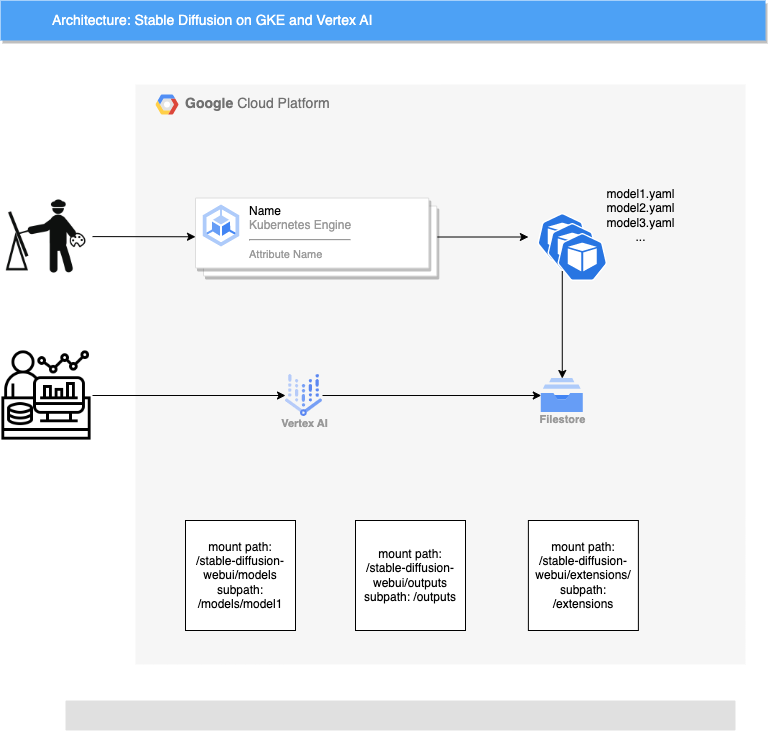

# Stable-Diffusion on Google Cloud Quick Start Guide

This guide give simple steps for stable-diffusion users to launch a stable diffusion deployment by using GCP GKE service, and using Filestore as shared storage for model and output files. User can just follow the step have your stable diffusion model running.

* [Introduction](#Introduction)
* [How-To-Manual-provision-infra](#How-To-Manual-provision-infra)
* [How-To-terraform-provision-infra](./terraform-provision-infra/README.md)
* [How-To-build-images-use-cloudbuild](./terraform-provision-infra/README.md)


## Introduction
   This project is using the [Stable-Diffusion-WebUI](https://github.com/AUTOMATIC1111/stable-diffusion-webui) open source as the user interactive front-end, customer can just prepare the stable diffusion model to build/deployment stable diffusion model by container. This project use the cloud build to help you quick build up a docker image with your stable diffusion model, then you can make a deployment base on the docker image.



* Architecture GKE + GPU + spot + Vertex AI custom training
* No conflicts for multi users, one deployment per model, use different mount point to distinguish models
* Scaling with HPA with GPU metrics, support GPU time sharing
* Inference and training on WebUI
* Dreambooth Training on Vertex AI
* Optimized for vram saving, Inference+Training can be done in a T4 GPU
* No intrusive change against 1111 webui, easy to upgrade or install extensions with Dockerfile

## How-To-Manual-provision-infra

you can use the cloud shell as the run time to do below steps.
### Before you begin
1. make sure you have an available GCP project for your deployment
2. Enable the required service API using [cloud shell](https://cloud.google.com/shell/docs/run-gcloud-commands)
```
gcloud services enable compute.googleapis.com artifactregistry.googleapis.com container.googleapis.com file.googleapis.com
```
### Create GKE Cluster
Do the following step using the cloud shell. This guide using the T4 GPU node as the VM host, by your choice you can change the node type with [other GPU instance type](https://cloud.google.com/compute/docs/gpus). \
In this guide we also enabled [Filestore CSI driver](https://cloud.google.com/kubernetes-engine/docs/how-to/persistent-volumes/filestore-csi-driver) for models/outputs sharing. \
We will also enable [GPU time sharing](https://cloud.google.com/kubernetes-engine/docs/how-to/timesharing-gpus#enable-cluster) to optimize GPU utilization for inference workload. \
We used a custom intance type which is 4c48Gi, since we are going to assign 2c22Gi to each pod. \

**NOTE: If you are creating a private cluster, create [Cloud NAT gateway](https://cloud.google.com/nat/docs/gke-example#create-nat) to ensure you node pool has access to the internet.**
```shell
PROJECT_ID=<replace this with your project id>
GKE_CLUSTER_NAME=<replace this with your GKE cluster name>
REGION=<replace this with your region>
ZONE=<replace this with your zone>
VPC_NETWORK=<replace this with your vpc network name>
VPC_SUBNETWORK=<replace this with your vpc subnetwork name>
CLIENT_PER_GPU=<replace this with the number of clients to share 1 GPU, a proper value is 2 or 3>

# create a regional cluster
gcloud beta container --project ${PROJECT_ID} clusters create ${GKE_CLUSTER_NAME} --region ${REGION} \
    --no-enable-basic-auth --cluster-version "1.24.9-gke.3200" --release-channel "None" \
    --machine-type "custom-4-49152-ext" --accelerator "type=nvidia-tesla-t4,count=1,gpu-sharing-strategy=time-sharing,max-shared-clients-per-gpu=${CLIENT_PER_GPU}" \
    --image-type "COS_CONTAINERD" --disk-type "pd-balanced" --disk-size "100" \
    --metadata disable-legacy-endpoints=true --scopes "https://www.googleapis.com/auth/cloud-platform" \
    --num-nodes "1" --logging=SYSTEM,WORKLOAD --monitoring=SYSTEM --enable-private-nodes \
    --master-ipv4-cidr "172.16.1.0/28" --enable-ip-alias --network "projects/${PROJECT_ID}/global/networks/${VPC_NETWORK}" \
    --subnetwork "projects/${PROJECT_ID}/regions/${REGION}/subnetworks/${VPC_SUBNETWORK}" \
    --no-enable-intra-node-visibility --default-max-pods-per-node "110" --no-enable-master-authorized-networks \
    --addons HorizontalPodAutoscaling,HttpLoadBalancing,GcePersistentDiskCsiDriver,GcpFilestoreCsiDriver \
    --enable-autoupgrade --no-enable-autorepair --max-surge-upgrade 1 --max-unavailable-upgrade 0 \
    --enable-autoprovisioning --min-cpu 1 --max-cpu 64 --min-memory 1 --max-memory 256 \
    --autoprovisioning-scopes=https://www.googleapis.com/auth/cloud-platform --no-enable-autoprovisioning-autorepair \
    --enable-autoprovisioning-autoupgrade --autoprovisioning-max-surge-upgrade 1 --autoprovisioning-max-unavailable-upgrade 0 \
    --enable-vertical-pod-autoscaling --enable-shielded-nodes


# create a zonal cluster
gcloud beta container --project ${PROJECT_ID} clusters create ${GKE_CLUSTER_NAME} --zone ${ZONE} \
    --no-enable-basic-auth --cluster-version "1.24.9-gke.3200" --release-channel "None" \
    --machine-type "custom-4-49152-ext" --accelerator "type=nvidia-tesla-t4,count=1,gpu-sharing-strategy=time-sharing,max-shared-clients-per-gpu=${CLIENT_PER_GPU}" \
    --image-type "COS_CONTAINERD" --disk-type "pd-balanced" --disk-size "100" \
    --metadata disable-legacy-endpoints=true --scopes "https://www.googleapis.com/auth/cloud-platform" \
    --num-nodes "1" --logging=SYSTEM,WORKLOAD --monitoring=SYSTEM --enable-private-nodes \
    --master-ipv4-cidr "172.16.1.0/28" --enable-ip-alias --network "projects/${PROJECT_ID}/global/networks/${VPC_NETWORK}" \
    --subnetwork "projects/${PROJECT_ID}/regions/${REGION}/subnetworks/${VPC_SUBNETWORK}" \
    --no-enable-intra-node-visibility --default-max-pods-per-node "110" --no-enable-master-authorized-networks \
    --addons HorizontalPodAutoscaling,HttpLoadBalancing,GcePersistentDiskCsiDriver,GcpFilestoreCsiDriver \
    --enable-autoupgrade --no-enable-autorepair --max-surge-upgrade 1 --max-unavailable-upgrade 0 \
    --enable-autoprovisioning --min-cpu 1 --max-cpu 64 --min-memory 1 --max-memory 256 \
    --autoprovisioning-scopes=https://www.googleapis.com/auth/cloud-platform --no-enable-autoprovisioning-autorepair \
    --enable-autoprovisioning-autoupgrade --autoprovisioning-max-surge-upgrade 1 --autoprovisioning-max-unavailable-upgrade 0 \
    --enable-vertical-pod-autoscaling --enable-shielded-nodes


```

### Create NAT and Cloud Router (Optional if you create a private cluster)
```shell
# create cloud router
gcloud compute routers create nat-router --network ${VPC_NETWORK} --region ${REGION}

# create nat 
gcloud compute routers nats create nat-gw --router=nat-router --region ${REGION} --auto-allocate-nat-external-ips --nat-all-subnet-ip-ranges

```

### Get credentials of GKE cluster
```shell
# For regional cluster
gcloud container clusters get-credentials ${GKE_CLUSTER_NAME} --region ${REGION}

# For regional cluster
gcloud container clusters get-credentials ${GKE_CLUSTER_NAME} --region ${REGION}

```

### Install GPU Driver
```shell
kubectl apply -f https://raw.githubusercontent.com/GoogleCloudPlatform/container-engine-accelerators/master/nvidia-driver-installer/cos/daemonset-preloaded.yaml
```

### Create Cloud Artifacts as Docker Repo
```
BUILD_REGIST=<replace this with your preferred Artifacts repo name>

gcloud artifacts repositories create ${BUILD_REGIST} --repository-format=docker \
--location=${REGION}

gcloud auth configure-docker ${REGION}-docker.pkg.dev
```


### Build Stable Diffusion Image
Build image with provided Dockerfile, push to repo in Cloud Artifacts \
Please note I have prepared two individual Dockerfile for inference and training, for inference, we don't include dreambooth extension for training.

```
cd gcp-stable-diffusion-build-deploy/Stable-Diffusion-UI-Novel/docker_inference

# build image local (machine at least 8GB memory avaliable)
docker build . -t ${REGION}-docker.pkg.dev/${PROJECT_ID}/${BUILD_REGIST}/sd-webui:inference
docker push 

# build image with cloud build
gcloud builds submit --machine-type=e2-highcpu-32 --disk-size=100 --region=${REGION} -t ${REGION}-docker.pkg.dev/${PROJECT_ID}/${BUILD_REGIST}/sd-webui:inference 

```

### Create Filestore
Create Filestore storage, mount and prepare files and folders for models/outputs/training data \
You should prepare a VM to mount the filestore instance. \
**NOTE: models/Stable-Diffusion/ folder is not empty, mounting the filestore share directly will lose some folders and error out. \
One easy way for this is to mount the filestore share, copy the folders from repo's models/Stable-Diffusion/ before being used by pods.**

```
FILESTORE_NAME=<replace with filestore instance name>
FILESTORE_ZONE=<replace with filestore instance zone>
FILESHARE_NAME=<replace with filestore share name>


gcloud filestore instances create ${FILESTORE_NAME} --zone=${FILESTORE_ZONE} --tier=BASIC_HDD --file-share=name=${FILESHARE_NAME},capacity=1TB --network=name=${VPC_NETWORK}
gcloud filestore instances create nfs-store --zone=us-central1-b --tier=BASIC_HDD --file-share=name="vol1",capacity=1TB --network=name=${VPC_NETWORK}

```

### Enable Node Pool Autoscale
Set the Node pool with cluster autoscale(CA) capability, when the horizonal pod autocale feature scale up the pod replica size, it will trigger the node pool scale out to provide required GPU resource.
```
gcloud container clusters update ${GKE_CLUSTER_NAME} \
    --enable-autoscaling \
    --node-pool=default-pool \
    --min-nodes=0 \
    --max-nodes=5 \
    --region=${REGION}
```

### Enable Horizonal Pod Autoscale(HPA)
Install the stackdriver adapter to enable the stable-diffusion deployment scale with GPU usage metrics.

```
# optional, just to ensure you have necessary privilege for the cluster
kubectl create clusterrolebinding cluster-admin-binding \
    --clusterrole cluster-admin --user "$(gcloud config get-value account)"
```

```
kubectl apply -f https://raw.githubusercontent.com/GoogleCloudPlatform/k8s-stackdriver/master/custom-metrics-stackdriver-adapter/deploy/production/adapter_new_resource_model.yaml
```

Deploy horizonal pod autoscale policy on the stable-diffusion deployment
```
kubectl apply -f ./Stable-Diffusion-UI-Novel/kubernetes/hpa.yaml
```
Note: if in GKE clsuter that enable GPU timesharing feature gate, please using the hpa-timeshare.yaml, before deployment, substitude the GKE_CLUSTER_NAME in the file.

## Other notes
### About multi users/session
AUTOMATIC1111's Stable Diffusion WebUI does not support multi users/session at this moment, you can refer to,
https://github.com/AUTOMATIC1111/stable-diffusion-webui/issues/7970

So the corrent solution is, one deployment/service for one models.

### About file structure
Instead of building image for each model, we are using one image with share storage from Filestore and properly orchestration for our files and folders.
Please refer to the deployment_*.yaml for reference

You folders structure could probably like this in your Filestore share
```
/models/Stable-diffusion # <--- This is where SD webui looking for models, support models inside a folder
|-- nai
|   |-- nai.ckpt
|   |-- nai.vae.pt
|   `-- nai.yaml
|-- sd15
|   `-- v1-5-pruned-emaonly.safetensors

/inputs/ # <--- for training images, only use it when running train job from UI(sd_dreammbooth_extension)
|-- alvan-nee-cropped
|   |-- alvan-nee-9M0tSjb-cpA-unsplash_cropped.jpeg
|   |-- alvan-nee-Id1DBHv4fbg-unsplash_cropped.jpeg
|   |-- alvan-nee-bQaAJCbNq3g-unsplash_cropped.jpeg
|   |-- alvan-nee-brFsZ7qszSY-unsplash_cropped.jpeg
|   `-- alvan-nee-eoqnr8ikwFE-unsplash_cropped.jpeg

/outputs/ # <--- for generated images
|-- img2img-grids
|   `-- 2023-03-14
|       |-- grid-0000.png
|       `-- grid-0001.png
|-- img2img-images
|   `-- 2023-03-14
|       |-- 00000-425382929.png
|       |-- 00001-631481262.png
|       |-- 00002-1301840995.png
```
