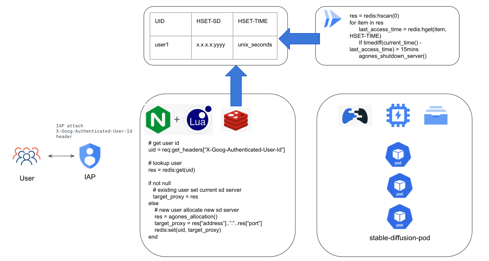

# Stable-Diffusion on Agones Implementation Guide

This guide give simple steps for stable-diffusion users to launch a stable diffusion deployment by using GCP GKE service, and using Filestore as shared storage for model and output files. For convinent multi-user stable-diffusion runtime management, using the [Agones](https://agones.dev/site/) as the runtime management operator, each isolated stable-diffusion runtime is hosted in an isolated POD, each authorized user will be allocated a dedicated POD. User can just follow the step have your stable diffusion model running.

* [Introduction](#Introduction)
* [How-To](#how-to)

## Introduction
   This project is using the [Stable-Diffusion-WebUI](https://github.com/AUTOMATIC1111/stable-diffusion-webui) open source as the user interactive front-end, customer can just prepare the stable diffusion model to build/deployment stable diffusion model by container. This project use the cloud build to help you quick build up a docker image with your stable diffusion model, then you can make a deployment base on the docker image. To give mutli-user isolated stable-diffussion runtime, using the [Agones](https://agones.dev/site/) as the stable-diffusion fleet management operator, Agones manage the stable diffussion runtime's lifecycle and control the autoscaling based on user demand.

## Architecture


## How To
you can use the cloud shell as the run time to do below steps.
### Before you begin
1. make sure you have an available GCP project for your deployment
2. Enable the required service API using [cloud shell](https://cloud.google.com/shell/docs/run-gcloud-commands)
```
gcloud services enable compute.googleapis.com artifactregistry.googleapis.com container.googleapis.com file.googleapis.com vpcaccess.googleapis.com redis.googleapis.com cloudscheduler.googleapis.com
```
### Create GKE Cluster
do the following step using the cloud shell. This guide using the T4 GPU node as the VM host, by your choice you can change the node type with [other GPU instance type](https://cloud.google.com/compute/docs/gpus).
In this guide we also enabled [Filestore CSI driver](https://cloud.google.com/kubernetes-engine/docs/how-to/persistent-volumes/filestore-csi-driver) for models/outputs sharing.

```
PROJECT_ID=<replace this with your project id>
GKE_CLUSTER_NAME=<replace this with your GKE cluster name>
REGION=<replace this with your region>
VPC_NETWORK=<replace this with your vpc network name>
VPC_SUBNETWORK=<replace this with your vpc subnetwork name>

gcloud beta container --project ${PROJECT_ID} clusters create ${GKE_CLUSTER_NAME} --region ${REGION} \
    --no-enable-basic-auth --cluster-version "1.24.11-gke.1000" --release-channel "None" \
    --machine-type "e2-standard-2" \
    --image-type "COS_CONTAINERD" --disk-type "pd-balanced" --disk-size "100" \
    --metadata disable-legacy-endpoints=true --scopes "https://www.googleapis.com/auth/cloud-platform" \
    --num-nodes "1" --logging=SYSTEM,WORKLOAD --monitoring=SYSTEM --enable-ip-alias \
    --network "projects/${PROJECT_ID}/global/networks/${VPC_NETWORK}" \
    --subnetwork "projects/${PROJECT_ID}/regions/${REGION}/subnetworks/${VPC_SUBNETWORK}" \
    --no-enable-intra-node-visibility --default-max-pods-per-node "110" --no-enable-master-authorized-networks \
    --addons HorizontalPodAutoscaling,HttpLoadBalancing,GcePersistentDiskCsiDriver,GcpFilestoreCsiDriver \
    --autoscaling-profile optimize-utilization

gcloud beta container --project ${PROJECT_ID} node-pools create "gpu-pool" --cluster ${GKE_CLUSTER_NAME} --region ${REGION} --machine-type "custom-4-49152-ext" --accelerator "type=nvidia-tesla-t4,count=1" --image-type "COS_CONTAINERD" --disk-type "pd-balanced" --disk-size "100" --metadata disable-legacy-endpoints=true --scopes "https://www.googleapis.com/auth/cloud-platform" --enable-autoscaling --total-min-nodes "0" --total-max-nodes "6" --location-policy "ANY" --enable-autoupgrade --enable-autorepair --max-surge-upgrade 1 --max-unavailable-upgrade 0 --max-pods-per-node "110" --num-nodes "0"
```
**NOTE: If you are creating a private GKE cluster, setup a firewall rule to allow**
1. all internal CIDR(10.0.0.0/8, 172.16.0.0/16, 192.168.0.0/24). Specifically, CIDR range for pod, but using all internal CIDR will be easier.
2. for TCP port 443/8080/8081 & 7000-8000 and UDP port 7000-8000
3. for source tag as gke node tag, e.g. gke-gke-01-7267dc32-node, you can find it in your VM console.

### Get credentials of GKE cluster
```
gcloud container clusters get-credentials ${GKE_CLUSTER_NAME} --region ${REGION}
```

### Install GPU Driver
```
kubectl apply -f https://raw.githubusercontent.com/GoogleCloudPlatform/container-engine-accelerators/master/nvidia-driver-installer/cos/daemonset-preloaded.yaml
```
If using lateset GPU instance, e.g. G2/L4, use below command instead for a more recent driver.
```
kubectl apply -f https://raw.githubusercontent.com/GoogleCloudPlatform/container-engine-accelerators/master/nvidia-driver-installer/cos/daemonset-preloaded-latest.yaml
```

### Create Cloud Artifacts as Docker Repo
```
BUILD_REGIST=<replace this with your preferred Artifacts repo name>

gcloud artifacts repositories create ${BUILD_REGIST} --repository-format=docker \
--location=${REGION}

gcloud auth configure-docker ${REGION}-docker.pkg.dev
```


### Build Stable Diffusion Image
Build image with provided Dockerfile, push to repo in Cloud Artifacts

```
cd Stable-Diffusion-on-GCP/Stable-Diffusion-UI-Agones/sd-webui
docker build . -t ${REGION}-docker.pkg.dev/${PROJECT_ID}/${BUILD_REGIST}/sd-webui:0.1
docker push ${REGION}-docker.pkg.dev/${PROJECT_ID}/${BUILD_REGIST}/sd-webui:0.1

```

### Create Filestore
Create Filestore storage, mount and prepare files and folders for models/outputs/training data
You should prepare a VM to mount the filestore instance.

```
FILESTORE_NAME=<replace with filestore instance name>
FILESTORE_ZONE=<replace with filestore instance zone>
FILESHARE_NAME=<replace with fileshare name>


gcloud filestore instances create ${FILESTORE_NAME} --zone=${FILESTORE_ZONE} --tier=BASIC_HDD --file-share=name=${FILESHARE_NAME},capacity=1TB --network=name=${VPC_NETWORK}
gcloud filestore instances create nfs-store --zone=us-central1-b --tier=BASIC_HDD --file-share=name="vol1",capacity=1TB --network=name=${VPC_NETWORK}

```
Deploy the PV and PVC resource, replace the nfs-server-ip using the nfs instance's ip address that created before in the file nfs_pv.yaml.
```
kubectl apply -f ./Stable-Diffusion-UI-Agones/agones/nfs_pv.yaml
kubectl apply -f ./Stable-Diffusion-UI-Agones/agones/nfs_pvc.yaml
```

### Install Agones
Install the Agones operator on default-pool, the default pool is long-run node pool that host the Agones Operator.
Note: for quick start, you can using the cloud shell which has helm installed already.
```
helm repo add agones https://agones.dev/chart/stable
helm repo update
kubectl create namespace agones-system
cd Stable-Diffusion-on-GCP/Stable-Diffusion-UI-Agones
helm install sd-agones-release --namespace agones-system -f ./agones/values.yaml agones/agones
```

### Create Redis Cache
Create a redis cache instance to host the access information.
```
gcloud redis instances create --project=${PROJECT_ID}  sd-agones-cache --tier=standard --size=1 --region=${REGION} --redis-version=redis_6_x --network=projects/${PROJECT_ID}/global/networks/${VPC_NETWORK} --connect-mode=DIRECT_PEERING
```

Record the redis instance connection ip address.
```
gcloud redis instances describe sd-agones-cache --region ${REGION} --format=json | jq .host
```

### Build simple game server image
Build image with provided Dockerfile, push to repo in Cloud Artifacts.
```
cd Stable-Diffusion-on-GCP/Stable-Diffusion-UI-Agones/agones-sidecar
docker build . -t ${REGION}-docker.pkg.dev/${PROJECT_ID}/${BUILD_REGIST}/simple-game-server:0.1
docker push ${REGION}-docker.pkg.dev/${PROJECT_ID}/${BUILD_REGIST}/simple-game-server:0.1
```

### Prepare Cloud Function Serverless VPC Access
Create serverless VPC access connector, which is used by cloud function to connect the private connection endpoint.
```
gcloud compute networks vpc-access connectors create sd-agones-connector --network ${VPC_NETWORK} --region ${REGION} --range 192.168.240.16/28
```

### Deploy Cloud Function Cruiser Program
This Cloud Function work as Cruiser to monitor the idle user, by default when the user is idle for 15mins, the stable-diffusion runtime will be collected back. Please replace ${REDIS_HOST} with the redis instance ip address that record in previous step. To custom the idle timeout default setting, please overwrite setting by setting the variable TIME_INTERVAL.
```
cd ./Stable-Diffusion-on-GCP/Stable-Diffusion-UI-Agones/cloud-function
gcloud functions deploy redis_http --runtime python310 --trigger-http --allow-unauthenticated --region=${REGION} --vpc-connector=sd-agones-connector --egress-settings=private-ranges-only --set-env-vars=REDIS_HOST=${REDIS_HOST}
```
Record the Function trigger url.
```
gcloud functions describe redis_http --region us-central1 --format=json | jq .httpsTrigger.url
```
Create the cruiser scheduler. Please change ${FUNCTION_URL} with url in previous step.
```
gcloud scheduler jobs create http sd-agones-cruiser \
    --location=${REGION} \
    --schedule="*/5 * * * *" \
    --uri=${FUNCTION_URL}
```

### Deploy Cloud Function GS Controller
This function is used to handle Stable Diffusion POD Creation request, when the user init the access to the env, it will trigger this function to create a Stable Diffusion POD.
Record the GKE Cluster API Server Endpoint IP address
```
gcloud container clusters describe ${GKE_CLUSTER_NAME} --region us-central1 --format=json | jq .privateClusterConfig.publicEndpoint
```
Update the gs.yaml file with the Stable-Diffusion-WebUI docker image url and simple-game-server docker image url
```
cd ./Stable-Diffusion-on-GCP/Stable-Diffusion-UI-Agones/cloud-function-gs-controller/localpackage
# then change the image url in the gs.yaml file
```
Create the GS Controller Function, please replace the ${K8S_ENDPOINT} with the Endpoint IP address in last step.
```
cd ./Stable-Diffusion-on-GCP/Stable-Diffusion-UI-Agones/cloud-function-gs-controller
gcloud functions deploy agones_gs_backend --runtime python310 --trigger-http --allow-unauthenticated --region=${REGION} --set-env-vars=k8s_endpoint=${K8S_ENDPOINT}
```

### Deploy Cloud Function State Controller
This function is used to manage Stable Diffusion POD State, it bases on agones-relay-http event, when the Stable Diffusion POD State(internal state not kubernete pod state) change, this function will act on the change event, and update the related redis values.
```
cd ./Stable-Diffusion-on-GCP/Stable-Diffusion-UI-Agones/cloud-function-state-controller
gcloud functions deploy agones_listener_http --runtime python310 --trigger-http --allow-unauthenticated --region=${REGION} --vpc-connector=sd-agones-connector --egress-settings=private-ranges-only --set-env-vars=REDIS_HOST=${REDIS_HOST}
```

### Deploy agones-http-relay
This controller is used to relay the Stable Diffusion POD State Change Event to the Cloud Function State Controller.
Build the image
```
cd ./Stable-Diffusion-on-GCP/Stable-Diffusion-UI-Agones/agones-relay-http
docker build . -t ${REGION}-docker.pkg.dev/${PROJECT_ID}/${BUILD_REGIST}/agones-relay-http:0.1
docker push ${REGION}-docker.pkg.dev/${PROJECT_ID}/${BUILD_REGIST}/agones-relay-http:0.1
```
Get the Cloud Function State Controller URL
```
gcloud functions describe agones_listener_http --region us-central1 --format=json | jq .httpsTrigger.url
```
Update the deployment file then deploy it
```
cd ./Stable-Diffusion-on-GCP/Stable-Diffusion-UI-Agones/agones-relay-http/deploy
# update the install.yaml
# change the  <agones-relay-http-image> to the image you build in previous step
# change the <cloud-function-state-controller-url> to the cloud function state controller url
kubectl apply -f install.yaml
```

### Build nginx proxy image
Build image with provided Dockerfile, push to repo in Cloud Artifacts. Please replace ${REDIS_HOST} in the gcp-stable-diffusion-build-deploy/Stable-Diffusion-UI-Agones/nginx/sd.lua with the ip address record in previous step, replace the ${agones_gs_backend} with the trigger url below:

Record the Function trigger url.
```
gcloud functions describe agones_gs_backend --region us-central1 --format=json | jq .httpsTrigger.url
```

```
cd Stable-Diffusion-on-GCP/Stable-Diffusion-UI-Agones/nginx
docker build . -t ${REGION}-docker.pkg.dev/${PROJECT_ID}/${BUILD_REGIST}/sd-nginx:0.1
docker push ${REGION}-docker.pkg.dev/${PROJECT_ID}/${BUILD_REGIST}/sd-nginx:0.1
```

### Deploy stable-diffusion agones deployment
Deploy stable-diffusion agones deployment, please replace the image URL in the deployment.yaml and fleet yaml with the image built before.
```
kubectl apply -f ./Stable-Diffusion-on-GCP/Stable-Diffusion-UI-Agones/nginx/deployment.yaml
```

### Deploy IAP(identity awared proxy)
To allocate isolated stable-diffusion runtime and provide user access auth capability, using the Google Cloud IAP service as an access gateway to provide the identity check and prograge the idenity to the stable-diffusion backend.

Config the OAuth consent screen and OAuth credentials, check out the [guide](https://cloud.google.com/iap/docs/enabling-kubernetes-howto#oauth-configure).

Create an static external ip address, record the ip address.
```
gcloud compute addresses create sd-agones --global
gcloud compute addresses describe sd-agones --global --format=json | jq .address
```

Config BackendConfig, replace the client_id and client_secret with the OAuth client create before.
```
kubectl create secret generic iap-secret --from-literal=client_id=client_id_key \
    --from-literal=client_secret=client_secret_key
```
Change the DOMAIN_NAME1 in managed-cert.yaml with the environment domain, then deploy the depend resources.
```
kubectl apply -f ./ingress-iap/managed-cert.yaml
kubectl apply -f ./ingress-iap/backendconfig.yaml
kubectl apply -f ./ingress-iap/service.yaml
kubectl apply -f ./ingress-iap/ingress.yaml
```

Give the authorized users required priviledge to access the service. [Guide](https://cloud.google.com/iap/docs/enabling-kubernetes-howto#iap-access)


### FAQ
#### How could I troubleshooting if I get 502?
It is normal if you get 502 before pod is ready, you may have to wait for a few minutes for containers to be ready(usually below 3mins), then refresh the page.
If it is much longer then expected, then

1. Check stdout/stderr from pod
To see if webui has been launched successfully
```
kubectl logs -f pod/sd-agones-fleet-xxxxx-xxxxx -c stable-diffusion-webui
```
2. Check stderr from nginx+lua deployment
```
kubectl logs -f deployment.apps/stable-diffusion-nginx-deployment
```
3. Check redis keys
Clear all keys from redis before reusing it for new deployment
```
redis-cli -h ${redis_host}
keys *
del *
```
4. Check cloud scheduler & cloud function, the last run status should be "OK", otherwise check the logs.

#### Why there is a simple-game-server container in the fleet?
This is an example game server from agones, we leverage it as a game server sdk to interact with agones control plane without additional coding and change to webui.
The nginx+lua will call simple-game-server to indirectly interact with agones for resource allication and release.

#### How can I upload file to the pod?
We made an example [script](./Stable-Diffusion-UI-Agones/sd-webui/extensions/stable-diffusion-webui-udload/scripts/udload.py) to work as an extension for file upload.
Besides, you can use extensions for image browsing and downloading(https://github.com/zanllp/sd-webui-infinite-image-browsing), model/lora downloading(https://github.com/butaixianran/Stable-Diffusion-Webui-Civitai-Helper) and more.

5. Directory Structure in NFS
Please refer this directory struction to provison NFS, these settings will be used for Stable-Diffusion-WebUI Golden config, all the stable-diffusion-pod created will be init with the config from here, then any change from customer will be persisted in its own foler.
```
| --/
| --/sd-config
|    --/config.json
|    --/ui-config.json
| --/extensions
|    --
|    --
|    --..
| --/<username>
|    --/config.json
|    --/ui-config.json
|    --/extentions
|    --/output
```
6. Accelerate the Stable-Diffusion-WebUI Load Time
Customer can leverage the low-priority-class balloon POD to trigger the Node-Pool pre-provision, then it will help you to avoid the node provision and image pulling time. you can refer the folder /Stable-Diffusion-UI-Agones/agones, in the folder there is PriorityClass definition yaml(priorityclasses.yaml) and balloon POD deployment yaml(balloon_deployment.yaml), how it work detail you can checkout(https://cloud.google.com/kubernetes-engine/docs/how-to/capacity-provisioning). Note: this method can help to improve the start time but it will take extra cost.
