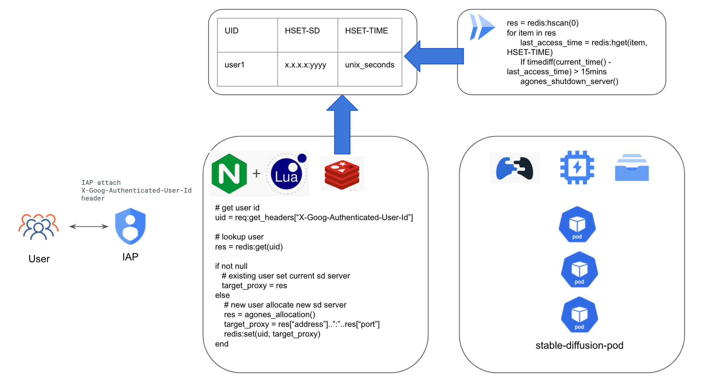

# Stable-Diffusion on Agones Implementation Guide

This guide gives simple steps for stable-diffusion users to launch a stable diffusion deployment by using GCP GKE service, and using Filestore as shared storage for models and output files. For convinent multi-user stable-diffusion runtime management, we used [Agones](https://agones.dev/site/) as the runtime management operator, each isolated stable-diffusion runtime is hosted in an isolated POD, each authorized user will be allocated a dedicated POD. User can just follow the following steps to have your stable diffusion model running.

* [Introduction](#Introduction)
* [How-To](#how-to)

## Introduction
   This project is using the [Stable-Diffusion-WebUI](https://github.com/AUTOMATIC1111/stable-diffusion-webui) open source as the user interactive front-end, customer can just prepare the stable diffusion model to build/deployment stable diffusion model by container. This project uses Cloud Build to help you quickly build a docker image with your stable diffusion model, then you can make a deployment base on the docker image. To give mutli-user isolated stable-diffussion runtime, we used [Agones](https://agones.dev/site/) as the stable-diffusion fleet management operator. Agones manages the stable diffussion runtime's lifecycle and control the autoscaling based on user demand.

## Architecture


## How To
you can use the cloud shell as the run time to perform below steps.
### Before you begin
1. Make sure you have an available GCP project with a VPC network for your deployment.
2. Enable the required service API using [cloud shell](https://cloud.google.com/shell/docs/run-gcloud-commands):
```
gcloud services enable compute.googleapis.com artifactregistry.googleapis.com container.googleapis.com file.googleapis.com vpcaccess.googleapis.com redis.googleapis.com cloudscheduler.googleapis.com cloudfunctions.googleapis.com cloudbuild.googleapis.com
```
### Create GKE Cluster
Run the following steps in Cloud Shell. This guide uses the T4 GPU node as the VM host. You can change the node type to [other GPU instance types](https://cloud.google.com/compute/docs/gpus) based on your needs.
In this guide we also enabled [Filestore CSI driver](https://cloud.google.com/kubernetes-engine/docs/how-to/persistent-volumes/filestore-csi-driver) for models/outputs sharing.

```
PROJECT_ID=<replace this with your project id>
GKE_CLUSTER_NAME=<replace this with your GKE cluster name>
REGION=<replace this with your region>
VPC_NETWORK=<replace this with your vpc network name>
VPC_SUBNETWORK=<replace this with your vpc subnetwork name>

gcloud beta container --project ${PROJECT_ID} clusters create ${GKE_CLUSTER_NAME} --region ${REGION} \
    --no-enable-basic-auth --cluster-version "1.25.8-gke.500" --release-channel "None" \
    --machine-type "e2-standard-2" \
    --image-type "COS_CONTAINERD" --disk-type "pd-balanced" --disk-size "100" \
    --metadata disable-legacy-endpoints=true --scopes "https://www.googleapis.com/auth/cloud-platform" \
    --num-nodes "1" --logging=SYSTEM,WORKLOAD --monitoring=SYSTEM --enable-ip-alias \
    --network "projects/${PROJECT_ID}/global/networks/${VPC_NETWORK}" \
    --subnetwork "projects/${PROJECT_ID}/regions/${REGION}/subnetworks/${VPC_SUBNETWORK}" \
    --no-enable-intra-node-visibility --default-max-pods-per-node "110" --no-enable-master-authorized-networks \
    --addons HorizontalPodAutoscaling,HttpLoadBalancing,GcePersistentDiskCsiDriver,GcpFilestoreCsiDriver \
    --autoscaling-profile optimize-utilization

gcloud beta container --project ${PROJECT_ID} node-pools create "gpu-pool" --cluster ${GKE_CLUSTER_NAME} --region ${REGION} --machine-type "custom-4-49152-ext" --accelerator "type=nvidia-tesla-t4,count=1" --image-type "COS_CONTAINERD" --disk-type "pd-balanced" --disk-size "100" --metadata disable-legacy-endpoints=true --scopes "https://www.googleapis.com/auth/cloud-platform" --spot --enable-autoscaling --total-min-nodes "0" --total-max-nodes "6" --location-policy "ANY" --enable-autoupgrade --enable-autorepair --max-surge-upgrade 1 --max-unavailable-upgrade 0 --max-pods-per-node "110" --num-nodes "0"
```
**NOTE: If you are creating a private GKE cluster, setup a firewall rule to allow**
1. all internal CIDR(10.0.0.0/8, 172.16.0.0/16, 192.168.0.0/24). Specifically, CIDR range for pod, but using all internal CIDR would be easier.
2. for TCP port 443/8080/8081 & 7000-8000 and UDP port 7000-8000
3. set source tag as gke node tag, e.g. gke-gke-01-7267dc32-node, you can find it in your VM console.

### Get credentials of GKE cluster
```
gcloud container clusters get-credentials ${GKE_CLUSTER_NAME} --region ${REGION}
```

### Install GPU Driver
```
kubectl apply -f https://raw.githubusercontent.com/GoogleCloudPlatform/container-engine-accelerators/master/nvidia-driver-installer/cos/daemonset-preloaded.yaml
```
If using lateset GPU instance, e.g. G2/L4, use below command instead for a more recent driver.
```
kubectl apply -f https://raw.githubusercontent.com/GoogleCloudPlatform/container-engine-accelerators/master/nvidia-driver-installer/cos/daemonset-preloaded-latest.yaml
```

### Create Cloud Artifacts as Docker Repo
```
BUILD_REGIST=<replace this with your preferred Artifacts repo name>

gcloud artifacts repositories create ${BUILD_REGIST} --repository-format=docker \
--location=${REGION}

gcloud auth configure-docker ${REGION}-docker.pkg.dev
```


### Build Stable Diffusion Image
Build image with provided Dockerfile, push to repositories in Artifact Registry.

```
cd Stable-Diffusion-on-GCP/Stable-Diffusion-UI-Agones/sd-webui
docker build . -t ${REGION}-docker.pkg.dev/${PROJECT_ID}/${BUILD_REGIST}/sd-webui:0.1
docker push ${REGION}-docker.pkg.dev/${PROJECT_ID}/${BUILD_REGIST}/sd-webui:0.1

```

### Create Filestore
Create Filestore storage, mount and prepare files and folders for models/outputs/training data
You should prepare a VM to mount the filestore instance.

```
FILESTORE_NAME=<replace with filestore instance name>
FILESTORE_ZONE=<replace with filestore instance zone>
FILESHARE_NAME=<replace with fileshare name>


gcloud filestore instances create ${FILESTORE_NAME} --zone=${FILESTORE_ZONE} --tier=BASIC_HDD --file-share=name=${FILESHARE_NAME},capacity=1TB --network=name=${VPC_NETWORK}
```
An example could look like:
```
gcloud filestore instances create nfs-store --zone=us-central1-b --tier=BASIC_HDD --file-share=name="vol1",capacity=1TB --network=name=${VPC_NETWORK}

```
Deploy the PV and PVC resource, replace the nfs-server-ip using the nfs instance's ip address that created before in the file nfs_pv.yaml.
```
kubectl apply -f ./Stable-Diffusion-UI-Agones/agones/nfs_pv.yaml
kubectl apply -f ./Stable-Diffusion-UI-Agones/agones/nfs_pvc.yaml
```

### Install Agones
Install the Agones operator on default-pool, the default pool is long-run node pool that host the Agones Operator.
Note: for quick start, you can using the cloud shell which has helm installed already.
```
helm repo add agones https://agones.dev/chart/stable
helm repo update
kubectl create namespace agones-system
cd Stable-Diffusion-on-GCP/Stable-Diffusion-UI-Agones
helm install sd-agones-release --namespace agones-system -f ./agones/values.yaml agones/agones
```

### Create Redis Cache
Create a redis cache instance to host the access information.
```
gcloud redis instances create --project=${PROJECT_ID}  sd-agones-cache --tier=standard --size=1 --region=${REGION} --redis-version=redis_6_x --network=projects/${PROJECT_ID}/global/networks/${VPC_NETWORK} --connect-mode=DIRECT_PEERING
```

Record the redis instance connection ip address.
```
gcloud redis instances describe sd-agones-cache --region ${REGION} --format=json | jq .host
```

### Build nginx proxy image
Build image with provided Dockerfile, push to repositories in Artifact Registry. Please replace ${REDIS_HOST} in the Stable-Diffusion-on-GCP/Stable-Diffusion-UI-Agones/nginx/sd.lua with the IP address recorded in the previous step.

```
cd Stable-Diffusion-on-GCP/Stable-Diffusion-UI-Agones/nginx
docker build . -t ${REGION}-docker.pkg.dev/${PROJECT_ID}/${BUILD_REGIST}/sd-nginx:0.1
docker push ${REGION}-docker.pkg.dev/${PROJECT_ID}/${BUILD_REGIST}/sd-nginx:0.1
```

### Deploy stable-diffusion agones deployment
Deploy stable-diffusion agones deployment, please replace the image URL in the deployment.yaml and fleet_pvc.yaml with the image built before.
```
kubectl apply -f ./Stable-Diffusion-on-GCP/Stable-Diffusion-UI-Agones/nginx/deployment.yaml
kubectl apply -f ./Stable-Diffusion-on-GCP/Stable-Diffusion-UI-Agones/agones/fleet_pvc.yaml
kubectl apply -f ./Stable-Diffusion-on-GCP/Stable-Diffusion-UI-Agones/agones/fleet_autoscale.yaml
```

### Create Serverless VPC Access for Cloud Functions
Create a [Serverless VPC Access connector](https://cloud.google.com/vpc/docs/serverless-vpc-access), which is used to connect your Cloud Functions directly to your Virtual Private Cloud (VPC) network, allowing access to Compute Engine virtual machine (VM) instances, Memorystore instances, and any other resources with an internal IP address.
```
gcloud compute networks vpc-access connectors create sd-agones-connector --network ${VPC_NETWORK} --region ${REGION} --range 192.168.240.16/28
```

### Deploy Cloud Function Cruiser Program
This Cloud Function works as Cruiser to monitor idle users. By default when the user is idle for 15 minutes, the stable-diffusion runtime will be collected back. Please replace ${REDIS_HOST} in the command with the redis instance IP address recorded before. You can change the value of variable TIME_INTERVAL to overwrite the default setting.
```
cd ./Stable-Diffusion-on-GCP/Stable-Diffusion-UI-Agones/cloud-function
gcloud functions deploy redis_http --runtime python310 --trigger-http --allow-unauthenticated --region=${REGION} --vpc-connector=sd-agones-connector --egress-settings=private-ranges-only --set-env-vars=REDIS_HOST=${REDIS_HOST}
```
Record the Cloud Function trigger URL.
```
gcloud functions describe redis_http --region us-central1 --format=json | jq .httpsTrigger.url
```
Create the cruiser scheduler. Please change ${FUNCTION_URL} with URL recorded in the previous step.
```
gcloud scheduler jobs create http sd-agones-cruiser \
    --location=${REGION} \
    --schedule="*/5 * * * *" \
    --uri=${FUNCTION_URL}
```

### Deploy IAP([Identity-Aware Proxy](https://cloud.google.com/iap))
To verify user identity, authenticate user and allocate isolated stable-diffusion runtime to each individual user. We used Google Cloud IAP service as an access gateway to provide access control capability and propragate user idenity to the stable-diffusion backend.

Configure the OAuth consent screen and create OAuth credentials by following this [guide](https://cloud.google.com/iap/docs/enabling-kubernetes-howto#oauth-configure).

Create an static external ip address, record the IP address.
```
gcloud compute addresses create sd-agones --global
gcloud compute addresses describe sd-agones --global --format=json | jq .address
```

Configure BackendConfig, replace the client_id and client_secret with the OAuth client created before.
```
kubectl create secret generic iap-secret --from-literal=client_id=client_id_key \
    --from-literal=client_secret=client_secret_key
```
Change the DOMAIN_NAME1 in managed-cert.yaml with the environment domain, then deploy the resources.
```
kubectl apply -f ./ingress-iap/managed-cert.yaml
kubectl apply -f ./ingress-iap/backendconfig.yaml
kubectl apply -f ./ingress-iap/service.yaml
kubectl apply -f ./ingress-iap/ingress.yaml
```

Give the authorized users required priviledge to access your Stable Diffusion service by following this [guide](https://cloud.google.com/iap/docs/enabling-kubernetes-howto#iap-access)

Change the DNS to point the A record of your domain to the K8s ingress external IP address.

### FAQ
#### How can I troubleshoot if I get 502?
It is normal if you get 502 before pod is ready, you may have to wait for a few minutes for containers to be ready (usually below 3mins), then refresh the page.
If it is much longer then expected, then

1. Check stdout/stderr from pod
To see if webui has been launched successfully
```
kubectl logs -f pod/sd-agones-fleet-xxxxx-xxxxx -c stable-diffusion-webui
```
2. Check stderr from nginx+lua deployment
```
kubectl logs -f deployment.apps/stable-diffusion-nginx-deployment
```
3. Check redis keys
Clear all keys from redis before reusing it for new deployment
```
redis-cli -h ${redis_host}
keys *
del *
```
4. Check Cloud Scheduler & Cloud Function, the last run status should be "OK", otherwise check the logs.

#### Why there is a simple-game-server container in the fleet?
This is an example game server from agones, we leverage it as a game server SDK to interact with agones control plane without additional coding and changes to the webui.
The nginx+lua will call simple-game-server to indirectly interact with agones for resource allocation and release.

#### How can I upload files to the pod?
We made an example [script](./Stable-Diffusion-UI-Agones/sd-webui/extensions/stable-diffusion-webui-udload/scripts/udload.py) to work as an extension for file upload.
Besides, you can use extensions for image browsing and downloading(https://github.com/zanllp/sd-webui-infinite-image-browsing), model/lora downloading(https://github.com/butaixianran/Stable-Diffusion-Webui-Civitai-Helper) and more.
